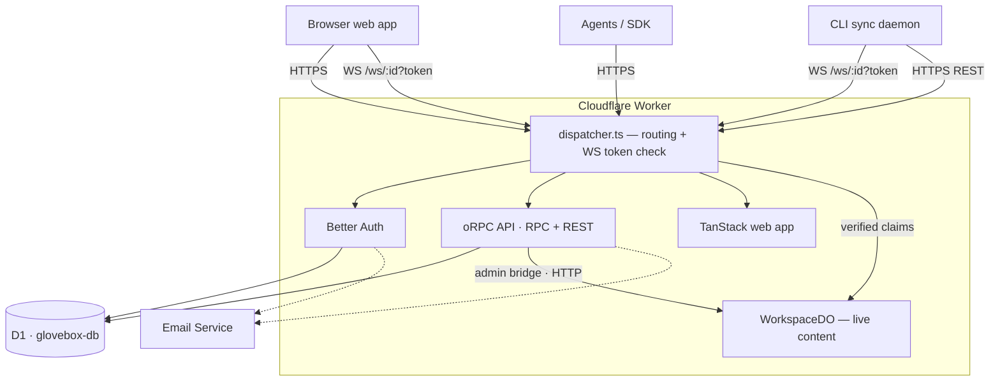
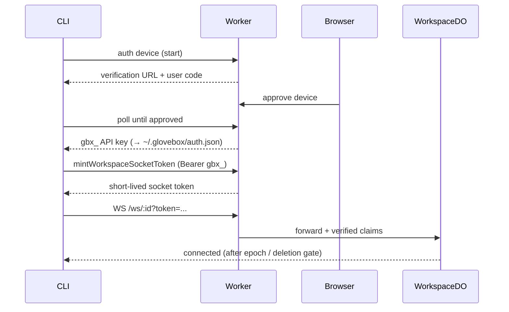
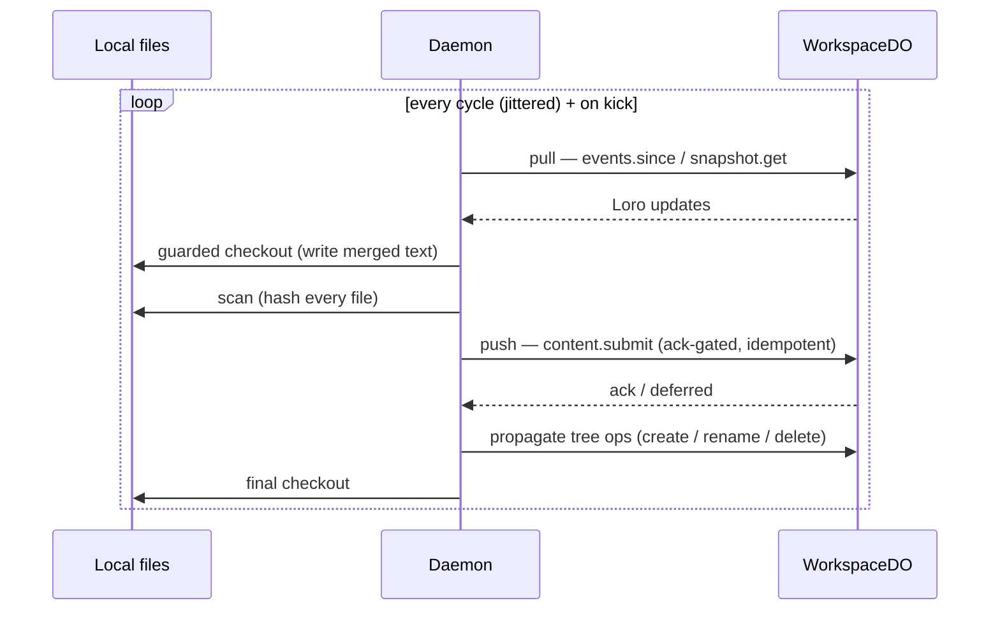

# Architecture

Glovebox keeps a local directory in sync with a shared workspace while the same
documents are edited live in the browser. Everything runs on a single Cloudflare
Worker: a stateless request layer (auth, CRUD API, web app) plus one **Durable
Object per workspace** that owns the live, collaborative content.

## Components

The Worker exposes everything under one `fetch` handler (`dispatcher.ts`), keyed
by path prefix:

| Prefix                | Handler                 | Purpose                          |
| --------------------- | ----------------------- | -------------------------------- |
| `/api/auth/*`         | Better Auth             | Sessions, device login, API keys |
| `/api/rpc/*`          | oRPC RPC handler        | Typed RPC for the web/SDK client |
| `/api/v1/*`, `/docs`  | oRPC OpenAPI handler    | REST + interactive API docs      |
| `/ws/:workspaceId`    | WorkspaceDO (WebSocket) | Live collaboration               |
| `/admin/workspaces/*` | WorkspaceDO (internal)  | Worker → DO content/admin bridge |
| everything else       | TanStack web app        | Server-rendered UI               |

## Data ownership

Two stores with a hard boundary — metadata in D1, live content in the DO.

| Store                  | Owns                                                                                                                                     |
| ---------------------- | ---------------------------------------------------------------------------------------------------------------------------------------- |
| **D1** (`glovebox-db`) | Auth (users, sessions, accounts, API keys, device codes), workspaces, members, invites, document/version metadata, comments, suggestions |
| **WorkspaceDO** SQLite | Live Loro CRDT documents, the workspace event log, presence, recovery records                                                            |

CRUD and content reads never touch the DO's socket: the API reaches durable
content through an internal HTTP bridge (`fetchWorkspaceDoAdmin` →
`/admin/workspaces/:id/text/{tree,read,push}`). Only live editing uses the
WebSocket.

## Authentication & connection

- **Browser** — Better Auth session cookies.
- **CLI / agents** — `gbx_` API keys (obtained via browser device login).
- **WebSocket** — a short-lived socket token minted from the API key. The Worker
  verifies the token (signature, expiry, workspace) and forwards trusted claims;
  the DO makes the final call against state only it knows (auth epoch, deletion).

## Collaboration & sync

Content is CRDT-based: every syncable (markdown) file is a **Loro document**
whose text lives in a single `content` container. The DO holds the authoritative
Loro docs and an append-only event log; clients exchange Loro updates and
converge. (The protocol also carries _opaque_ blobs for non-CRDT content.)

- **Browser** — `LoroRoomClient` over the WebSocket: edits apply locally, submit
  as Loro updates, and broadcast to peers. Presence rides the same socket.
- **CLI daemon** — cycle-driven, not watcher-driven. Each cycle does a full
  directory scan and reconciles both ways; a full scan is correctness, not an
  optimization, so a missed event never means lost data. WebSocket broadcasts
  are only debounced _hints_ that kick an earlier cycle.

The DO runs an hourly maintenance alarm (recovery pruning + shallow history
trim) and survives hibernation: peer IDs and sequence counters live in durable
storage, so eviction never resets the protocol state.

## Packages

| Package                     | Role                                                                       |
| --------------------------- | -------------------------------------------------------------------------- |
| `@glovebox/worker`          | Worker dispatcher, Better Auth, oRPC API, WorkspaceDO, web app             |
| `@glovebox/cli`             | Local file-sync daemon (`mount` / `run`)                                   |
| `@glovebox/api`             | oRPC contract + typed web/CLI clients                                      |
| `@glovebox/sync`            | Sync protocol: daemon, browser client, DO `WorkspaceServer`, Loro wrappers |
| `@glovebox/core`            | Shared types, protocol constants, workspace-event shapes                   |
| `@glovebox/loro-codemirror` | CodeMirror ↔ Loro editor binding                                           |
| `@glovebox/dofs`            | Durable Object filesystem primitives (vendored)                            |
